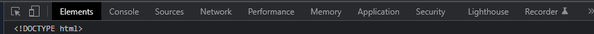
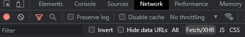
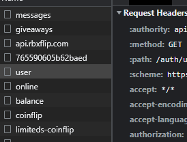

# Rbx-Flip-Sniper
This is a PoC for sniping limited items with a low $/1k robux rate in RBX Flip marketplace
# Requirements
[Python 3.x](https://www.python.org/downloads/release/python-3110/)
# Tutorial
To install this program locally execute the following commands: <br/>
```
git clone https://github.com/tHeFinAlGoaT/Rbx-Flip-Sniper
```
```
cd Rbx-Flip-Sniper
```
Once you've done that, put your auth token in the ```Token = ''``` variable <br/>
Not sure how to get that? i Gotchu <br/> 
<hr>


1. Go into your [RBX Flip](https://www.rbxflip.com/) <br/>
2. Press right click -> inspect or f12 <br/>
3. Head to the network tab <br/>
 <br/>
If you can't see it, press the 2 arrows ```>>``` and then select it or resize the dev console <br/>
4. Press Fetch/XHR <br/>
 <br/>
5. Reload the page
6. Press on ```user``` and copy whatever comes after ```Authorization: ``` <br/>
7.  <br/>
8. Paste in in between the ```''``` in the ```main.py``` file
